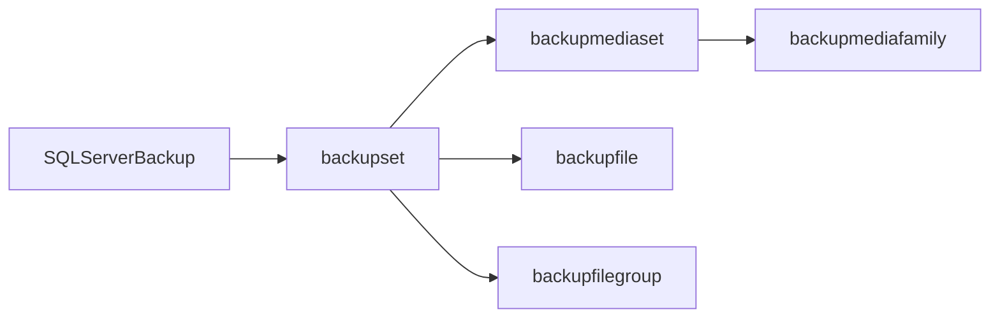

# 💾 Backup en SQL Server — SSMS vs T-SQL y otras opciones

Guía de referencia que empareja las opciones de backup disponibles en el asistente gráfico de SSMS con su equivalente en T-SQL. Además se incluyen diferentes ejemplos con T-SQL para realizar backups y consultar el historial de los mismos. Finalmente mostramos una recomendación de validación con **dbatools** y el uso de los scripts de Ola Hallengren.

---

## 🗂️ Índice

1. [Pestaña General — Origen y destino](#1--pestaña-general--origen-y-destino)
2. [Pestaña Media Options — Opciones de soporte](#2--pestaña-media-options--opciones-de-soporte)
3. [Pestaña Backup Options — Opciones del conjunto de backup](#3--pestaña-backup-options--opciones-del-conjunto-de-backup)
4. [Ejemplos completos en T-SQL](#4--ejemplos-completos-en-t-sql)
5. [Validación con dbatools](#5--validación-con-dbatools)
6. [Consultas sobre el historial de backups (msdb)](#6--consultas-sobre-el-historial-de-backups-msdb)
7. [Backup a Azure Blob Storage (URL)](#7--backup-a-azure-blob-storage-url)
8. [Backups con Ola Hallengren Maintenance Solution](#8--backups-con-ola-hallengren-maintenance-solution)

---

## 1 · Pestaña *General* — Origen y destino

### Base de datos y tipo de backup

| Opción en SSMS | Equivalente T-SQL | Notas |
|---|---|---|
| ***Database*** | `BACKUP DATABASE [nombre]` / `BACKUP LOG [nombre]` | Nombre de la base de datos sobre la que opera el backup |
| ***Recovery model*** | Solo informativo, no editable | Visible en SSMS pero no se puede cambiar desde aquí |
| ***Backup type: Full*** | `BACKUP DATABASE` | Copia completa de todos los datos |
| ***Backup type: Differential*** | `BACKUP DATABASE ... WITH DIFFERENTIAL` | Solo los cambios desde el último FULL |
| ***Backup type: Transaction Log*** | `BACKUP LOG` | Solo disponible con modelo de recuperación `FULL` o `BULK_LOGGED` |
| ***Copy-only backup*** | `WITH COPY_ONLY` | No rompe la cadena de backups — **útil para copias puntuales sin afectar a los procedimientos generales de copia de seguridad** |

### Componente de backup

| Opción en SSMS | Equivalente T-SQL | Notas |
|---|---|---|
| ***Database*** | `BACKUP DATABASE [nombre]` | Opción habitual — copia toda la base de datos |
| ***Files and filegroups*** | `BACKUP DATABASE [nombre] FILE = 'nombre_fichero'` o `FILEGROUP = 'nombre_filegroup'` | Muy útil en bases de datos muy grandes para estrategias de recuperación rápida |

### Destino

| Opción en SSMS | Equivalente T-SQL | Notas |
|---|---|---|
| ***Back up to: Disk*** | `TO DISK = 'ruta\fichero.bak'` | Opción habitual |
| ***Back up to: URL*** | `TO URL = 'https://...'` | Para Azure Blob Storage |
| **Múltiples destinos** | `TO DISK = '...', DISK = '...']` o `TO URL = '...', URL = '...']` | El backup se distribuye entre varios ficheros para mejorar el rendimiento |

```sql
-- Backup FULL a disco
BACKUP DATABASE [NombreBD]
    TO DISK = 'H:\DATA\NombreBD_Full.bak'
    WITH
        NAME = 'NombreBD-Full Database Backup',
        DESCRIPTION = 'Backup completo',
        STATS = 10;   -- Muestra progreso cada 10%

-- Backup diferencial
BACKUP DATABASE [NombreBD]
    TO DISK = 'H:\DATA\NombreBD_Diff.bak'
    WITH 
        DIFFERENTIAL,
        NAME = 'NombreBD-Differential Backup',
        STATS = 10;

-- Backup de log de transacciones
-- ⚠️ Solo disponible con Recovery Model = FULL o BULK_LOGGED
BACKUP LOG [NombreBD]
    TO DISK = 'H:\DATA\NombreBD_Log.trn'
    WITH
        NAME = 'NombreBD-Log Backup',
        STATS = 10;

-- Copy-only: no afecta a la cadena de backups
BACKUP DATABASE [NombreBD]
    TO DISK = 'H:\DATA\NombreBD_CopyOnly.bak'
    WITH 
        COPY_ONLY,
        NAME = 'NombreBD-Copy Only Backup',
        STATS = 10;
```

---

## 2 · Pestaña *Media Options* — Opciones de soporte

> Esta sección se centra en backups a **disco**. Las opciones de cinta ya en desuso en muchas organizaciones (`Tape drive`) quedan fuera del alcance de este documento.

### *Overwrite media* — Comportamiento sobre el fichero destino

Esta sección controla qué ocurre con el fichero `.bak` o `.trn` si ya existe o ya contiene backups previos.

| Opción en SSMS | Equivalente T-SQL | Cuándo usarla |
|---|---|---|
| ***Append to the existing backup set*** | `WITH NOINIT` | Añade el nuevo backup al final del fichero sin borrar los anteriores. Es el comportamiento **por defecto**. Útil para acumular múltiples backups en un mismo fichero. |
| ***Overwrite all existing backup sets*** | `WITH INIT` | Sobrescribe el contenido del fichero. Si el fichero existente se reutiliza, pero se pierden todos los backups anteriores que contenía. |
| ***Back up to a new media set, and erase all existing backup sets*** | `WITH FORMAT` | Crea un media set nuevo desde cero. Si el fichero existente se sobreescribe. **Requerido para poder usar cifrado.** |
| ***Check media set name and backup set expiration*** | `WITH NOSKIP, MEDIANAME = '...'` | Valida que el nombre del media set coincide y que ningún backup set contenido ha expirado antes de permitir la escritura.|

> 💡 Para backups a ficheros individuales y rotación diaria lo más habitual es usar `WITH INIT` o `WITH FORMAT` para evitar que los ficheros crezcan indefinidamente acumulando backups.<br>
> ⚠️ El anexado a un conjunto de copia de seguridad existente (`NOINIT`) no está soportado para backups cifrados. Cada backup cifrado debe residir en su propio media set, lo que hace obligatorio el uso de `FORMAT` y una estrategia de nombrado dinámico.

### *Reliability* — Fiabilidad

| Opción en SSMS | Equivalente T-SQL | Cuándo usarla |
|---|---|---|
| ***Verify backup when finished*** | Sin clausula directa. | Comprueba que el backup es legible una vez escrito. **No valida que los datos sean recuperables**, solo que el fichero no está corrupto. |
| ***Perform checksum before writing to media*** | `WITH CHECKSUM` | Calcula y almacena un checksum de cada página antes de escribirla. Permite detectar corrupción tanto en la escritura como en futuras restauraciones. **Muy recomendado.** |
| ***Continue on error*** | `WITH CONTINUE_AFTER_ERROR` | Continúa el backup aunque encuentre páginas con errores. Solo útil en situaciones de recuperación de emergencia, **no usar en backups de producción rutinarios.** |
```sql
-- La comprobación al final del backup se realiza con RESTORE VERIFYONLY a la finalización del backup
DECLARE @backupSetId AS INT

SELECT 
    @backupSetId = position 
FROM 
    msdb..backupset 
WHERE 
    database_name = N'NombreBD' 
    AND backup_set_id = (SELECT 
                            MAX(backup_set_id) 
                         FROM 
                            msdb..backupset 
                         WHERE 
                            database_name = N'NombreBD')

IF @backupSetId IS NULL BEGIN
	RAISERROR(N'Verify failed. Backup information for database ''Test'' not found.', 16, 1) 
END

RESTORE VERIFYONLY 
    FROM DISK = N'H:\DATA\NombreBD.bak' 
    WITH  
        FILE = @backupSetId
```

### *Transaction log*

| Opción en SSMS | Disponibilidad | Equivalente T-SQL |
|---|---|---|
| ***Truncate the transaction log*** | Solo con `BACKUP LOG` y Recovery Model `FULL` / `BULK_LOGGED` | Comportamiento por defecto en `BACKUP LOG` — libera el espacio del log ya respaldado |
| ***Back up the tail of the log, and leave...*** | Solo con `BACKUP LOG` | `WITH NO_TRUNCATE, NORECOVERY` — Esta opción permite realizar copias de seguridad del registro de transacciones cuando la base de datos está dañada. |

> ℹ️ Con ***Recovery* Model = SIMPLE** ambas opciones aparecen deshabilitadas en la interface de SSMS.

```sql
-- Append al fichero existente (por defecto)
BACKUP DATABASE [NombreBD]
    TO DISK = 'H:\DATA\NombreBD.bak'
    WITH 
        NOINIT,
        CHECKSUM,
        STATS = 10;

-- Sobrescribir el fichero existente
BACKUP DATABASE [NombreBD]
TO DISK = 'H:\DATA\NombreBD.bak'
    WITH 
        INIT,
        CHECKSUM,
        STATS = 10;

-- Nuevo media set (necesario para cifrado)
BACKUP DATABASE [NombreBD]
    TO DISK = 'H:\DATA\NombreBD.bak'
    WITH 
        FORMAT,
        MEDIANAME = 'NombreBD_MediaSet',
        CHECKSUM,
        ENCRYPTION (ALGORITHM = AES_256, SERVER CERTIFICATE = [MyCert2022]),
        STATS = 10;

-- Tail-log backup antes de restaurar
BACKUP LOG [NombreBD]
    TO DISK = 'H:\DATA\NombreBD_TailLog.trn'
    WITH 
        NORECOVERY,
        CHECKSUM,
        STATS = 10;
```

---

## 3 · Pestaña *Backup Options* — Opciones del conjunto de backup

### Identificación del backup set

| Opción en SSMS | Equivalente T-SQL | Notas |
|---|---|---|
| ***Name*** | `WITH NAME = '...'` | Nombre del backup set dentro del media. Útil para identificar el backup al restaurar. |
| ***Description*** | `WITH DESCRIPTION = '...'` | Descripción libre del backup set. |

### Expiración

| Opción en SSMS | Equivalente T-SQL | Notas |
|---|---|---|
| ***After N days*** | `WITH RETAINDAYS = N` | SQL Server no permitirá sobrescribir el backup hasta que pasen N días. `0` equivale a sin expiración. |
| ***On* (fecha concreta)** | `WITH EXPIREDATE = 'fecha'` | El backup expira en una fecha específica. |

> ℹ️ La expiración es una salvaguarda lógica, no física. SQL Server avisará si intentas sobrescribir un backup que no ha expirado, pero no impide borrar el fichero desde el sistema operativo.

### Compresión

| Opción en SSMS | Equivalente T-SQL | Disponibilidad |
|---|---|---|
| ***Use the default server setting*** | Sin cláusula explícita | Hereda la configuración de instancia (`backup compression default`) |
| ***Compress backup*** | `WITH COMPRESSION` | Disponible desde SQL Server 2008 en ediciones **Enterprise y Standard (2008 R2)** |
| ***Do not compress backup*** | `WITH NO_COMPRESSION` | Fuerza sin compresión aunque el servidor tenga la compresión habilitada por defecto |

> 💡 La compresión reduce el tamaño del fichero entre un 50-70% en la mayoría de los casos a cambio de mayor uso de CPU. En servidores con CPU disponible, **siempre merece la pena activarla**.

> ⚠️ Cuando TDE está activo, la compresión de backup opera sobre páginas ya cifradas, lo que hace que el ratio de compresión sea escaso en la mayoría de los casos.
>Las implicaciones prácticas son:
>- El uso de CPU para compresión se mantiene igual — SQL Server sigue intentando comprimir aunque no consiga reducción
>- Se consume CPU sin beneficio real en tamaño
>- En VLDBs con TDE activar compresión de backup es esencialmente desperdiciar CPU

### Cifrado

| Opción en SSMS | Equivalente T-SQL | Disponibilidad |
|---|---|---|
| ***Encrypt backup*** | `WITH ENCRYPTION (ALGORITHM = AES_256, SERVER CERTIFICATE = ...)` | Requiere **`WITH FORMAT`** en Media Options |
| ***Algorithm*** | `ALGORITHM = AES_128 / AES_192 / AES_256 / TRIPLE_DES_3KEY` | AES_256 es la recomendación actual |
| ***Certificate or Asymmetric key*** | `SERVER CERTIFICATE = nombre_certificado` | El certificado debe existir previamente en `master` |

> ⚠️ El cifrado aparece **deshabilitado en SSMS** cuando la opción seleccionada en Media Options es `Append` o `Overwrite` — solo se activa al seleccionar `Back up to a new media set`. En T-SQL esto equivale a requerir `WITH FORMAT`.

```sql
-- Backup con compresión y checksum (recomendación mínima para producción)
BACKUP DATABASE [NombreBD]
    TO DISK = 'H:\DATA\NombreBD_Full.bak'
    WITH 
        FORMAT,
        MEDIANAME = 'NombreBD_MediaSet',
        NAME = 'NombreBD-Full Database Backup',
        DESCRIPTION = 'Backup completo con compresión y checksum',
        COMPRESSION,
        CHECKSUM,
        RETAINDAYS = 7,
        STATS = 10;

-- Backup cifrado (requiere certificado previo en master)
-- Paso 1: Crear la master key y el certificado (solo la primera vez)
USE master;

CREATE MASTER KEY ENCRYPTION BY PASSWORD = 'P@ssw0rdSeguro!';

CREATE CERTIFICATE BackupCert
    WITH 
        SUBJECT = 'Certificado para cifrado de backups',
        EXPIRY_DATE = '2030-01-01';

-- Paso 2: Backup cifrado
BACKUP DATABASE [NombreBD]
    TO DISK = 'H:\DATA\NombreBD_Encrypted.bak'
    WITH 
        FORMAT,
        MEDIANAME = 'NombreBD_Encrypted',
        NAME = 'NombreBD-Encrypted Backup',
        COMPRESSION,
        CHECKSUM,
        ENCRYPTION (ALGORITHM = AES_256, SERVER CERTIFICATE = BackupCert),
        STATS = 10;

-- ⚠️ Si fuese necesario hacer backup del certificado inmediatamente — sin él el backup cifrado es irrecuperable
BACKUP CERTIFICATE BackupCert
    TO FILE = 'H:\CERTS\BackupCert.cer'
    WITH 
        PRIVATE KEY 
            (
                FILE = 'H:\CERTS\BackupCert.pvk',
                ENCRYPTION BY PASSWORD = 'P@ssw0rdCertificado!'
            );
```

---

## 4 · Ejemplos completos en T-SQL

### Estrategia posible: FULL semanal + DIFFERENTIAL cada 12 horas + LOG cada 10 minutos

Estrategia válida en entornos de producción con *Recovery Model* `FULL` donde se requiere mínima pérdida de datos (RPO bajo) y tiempos de restauración razonables. El `FULL` semanal minimiza el impacto en el servidor, el `DIFFERENTIAL` cada 12 horas reduce la cantidad de LOGs a aplicar en una restauración, y el `LOG` cada 10 minutos acota la pérdida máxima de datos a ese intervalo.

```sql
-- FULL semanal (ejecutar con un job los domingos a las 22:00)
BACKUP DATABASE [NombreBD]
    TO DISK = 'H:\DATA\Backups\FULL\NombreBD_Full_'
            + CONVERT(VARCHAR(8), GETDATE(), 112)
            + '.bak'
    WITH 
        FORMAT,
        NAME = 'NombreBD - Full Semanal',
        COMPRESSION,
        CHECKSUM,
        STATS = 10;

-- DIFFERENTIAL cada 12 horas (ejecutar con un job a las 06:00 y 18:00)
-- No ejecutar en la ventana del FULL para evitar solapamiento
BACKUP DATABASE [NombreBD]
    TO DISK = 'H:\DATA\Backups\DIFF\NombreBD_Diff_'
            + CONVERT(VARCHAR(8), GETDATE(), 112)
            + '_'
            + REPLACE(CONVERT(VARCHAR(8), GETDATE(), 108), ':', '')
            + '.bak'
    WITH 
        FORMAT,
        NAME = 'NombreBD - Differential',
        COMPRESSION,
        CHECKSUM,
        STATS = 10;

-- LOG cada 10 minutos (ejecutar con un job cada 10 minutos)
-- ⚠️ Solo disponible con Recovery Model = FULL o BULK_LOGGED
BACKUP LOG [NombreBD]
    TO DISK = 'H:\DATA\Backups\LOG\NombreBD_Log_'
            + CONVERT(VARCHAR(8), GETDATE(), 112)
            + '_'
            + REPLACE(CONVERT(VARCHAR(8), GETDATE(), 108), ':', '')
            + '.trn'
    WITH
        NAME = 'NombreBD - Log',
        COMPRESSION,
        CHECKSUM,
        STATS = 10;
```

> 💡 **Sobre la estructura de carpetas:** separar FULL, DIFF y LOG en subcarpetas distintas facilita enormemente la gestión de retención y la localización de ficheros durante una restauración. Una política de retención habitual para esta estrategia sería mantener **4 semanas** de FULLs, **48 horas** de DIFFs y **24 horas** de LOGs, ajustando según el espacio disponible y los requisitos de RPO/RTO del negocio.

> ⚠️ **Con TDE activo:** la opción `COMPRESSION` genera overhead de CPU sin beneficio real en reducción de tamaño al operar sobre páginas ya cifradas. Valorar sustituirla por `NO_COMPRESSION` explícito en ese escenario, sí a nivel de instancia tenemos configurado que se comprima por defecto.

---

## 5 · Validación con dbatools

Hacer el backup es solo la mitad del trabajo. **Un backup que no se ha probado a restaurar no es un backup fiable.** La función `Test-DbaLastBackup` de dbatools automatiza esta validación restaurando el backup en un entorno de prueba y verificando su integridad.

### Instalación de dbatools

```powershell
# Desde PowerShell (requiere acceso a internet o repositorio interno)
Install-Module dbatools -Scope AllUsers
```

### Uso básico

```powershell
# Valida el último backup de todas las bases de datos de una instancia
Test-DbaLastBackup -SqlInstance "NombreServidor"

# Valida solo una base de datos concreta
Test-DbaLastBackup -SqlInstance "NombreServidor" -Database "NombreBD"

# Especifica una instancia destino diferente para la restauración de prueba
Test-DbaLastBackup -SqlInstance "NombreServidor" `
                   -Destination "ServidorTest" `
                   -Database "NombreBD"
```

### Qué hace internamente `Test-DbaLastBackup`

1. Localiza el último backup completo (y diferencial / log si los hay) de cada base de datos
2. Restaura la cadena completa en la instancia destino con un nombre temporal
3. Ejecuta `DBCC CHECKDB` sobre la base de datos restaurada
4. Reporta el resultado: si el `CHECKDB` pasa sin errores, el backup es válido
5. Elimina la base de datos temporal de prueba

### Resultado de ejemplo

```
SourceServer   : <InstanciaOrigen>
TestServer     : <InstanciaDestino>
Database       : StackOverflow2013
FileExists     : True
Size           : 47,04 GB
RestoreResult  : Success
DbccResult     : Success
RestoreStart   : 2026-03-05 18:10:43.505
RestoreEnd     : 2026-03-05 18:11:18.027
RestoreElapsed : 00:00:34
DbccMaxDop     : 0
DbccStart      : 2026-03-05 18:11:18.059
DbccEnd        : 2026-03-05 18:11:57.215
DbccElapsed    : 00:00:39
BackupDates    : {2026-03-04 18:50:27.000, 2026-03-04 19:23:47.000}
BackupFiles    : {H:\DATA\StackOverflow2013-FULL_01.bak, H:\DATA\StackOverflow2013-FULL_02.bak,
                 H:\DATA\StackOverflow2013-LOG_01.trn, H:\DATA\StackOverflow2013-LOG_02.trn}
```

### Validación automática con dbatools

La validación periódica de backups puede automatizarse mediante un job de SQL Agent o scripts externos que ejecuten `Test-DbaLastBackup` y notifique por correo si alguna base de datos no supera la prueba de restauración o el DBCC.

#### Script PowerShell — `H:\SCRIPTS\Test-LastBackup.ps1`

El script se puede guardar en un fichero independiente para facilitar su mantenimiento sin necesidad de modificar el job cada vez que se actualice la lógica.
```powershell
Import-Module dbatools

$resultado = Test-DbaLastBackup -SqlInstance InstanciaOrigen -Destination InstanciaDestino -Database Test -EnableException

$fallos = $resultado | Where-Object {
    $_.RestoreResult -ne 'Success' -or $_.DbccResult -ne 'Success'
}

if ($fallos) {
    $body = $fallos | Select-Object Database, RestoreResult, DbccResult | Out-String

    $query = "EXEC msdb.dbo.sp_send_dbmail
                @profile_name = 'Alert_Profile',
                @recipients   = 'elcorreodemichel@gmail.com',
                @subject      = 'Validación de backups fallida',
                @body         = @body"

    Invoke-DbaQuery -SqlInstance SRV-2K22-DB01 -Database msdb `
        -Query $query `
        -SqlParameters @{ body = $body }
}
```

#### Configuración del paso en el job de SQL Agent

Creamos un step de tipo CMDExec invocando el fichero creado

```powershell
powershell.exe -NonInteractive -NoProfile -ExecutionPolicy Bypass -File "H:\\SCRIPTS\\Test-LastBackup.ps1"
```

> 💡 **Recomendación:** ejecutar `Test-DbaLastBackup` al menos una vez a la semana en todas las bases de datos críticas. La validación de backups es una de las tareas que más frecuentemente se omite en entornos de producción y una de las que más impacto tiene cuando ocurre un desastre real.

---

## 6 · Consultas sobre el historial de backups (msdb)

Las tablas de `msdb` registran cada backup realizado y toda su metadata. Son la fuente de verdad para auditar, validar y gestionar la política de copias de seguridad.

### Relación entre tablas



`backupmediaset` es el contenedor físico (el fichero `.bak`). `backupset` es cada backup individual que puede haber dentro de ese contenedor. `backupmediafamily` describe los ficheros físicos del media set. `backupfile` y `backupfilegroup` detallan los ficheros de datos y filegroups incluidos en cada backup.

---

### Último backup de cada tipo por base de datos

El punto de partida para cualquier auditoría de backups — de un vistazo sabes si alguna base de datos está desprotegida.

```sql
SELECT
    bs.database_name,
    MAX(CASE WHEN bs.type = 'D' THEN bs.backup_finish_date END)     AS last_full,
    MAX(CASE WHEN bs.type = 'I' THEN bs.backup_finish_date END)     AS last_differential,
    MAX(CASE WHEN bs.type = 'L' THEN bs.backup_finish_date END)     AS last_log,
    -- Antigüedad en horas del último FULL
    DATEDIFF(HOUR,
        MAX(CASE WHEN bs.type = 'D' THEN bs.backup_finish_date END),
        GETDATE())                                                   AS hours_since_last_full
FROM msdb.dbo.backupset bs
GROUP BY bs.database_name
ORDER BY bs.database_name;
```

---

### Bases de datos sin backup en las últimas 24 horas

Alerta inmediata para detectar bases de datos que han quedado fuera de la política de backups.

```sql
SELECT
    d.name                                                          AS database_name,
    d.recovery_model_desc,
    MAX(bs.backup_finish_date)                                      AS last_full_backup,
    DATEDIFF(HOUR, MAX(bs.backup_finish_date), GETDATE())           AS hours_without_backup
FROM sys.databases d
LEFT JOIN msdb.dbo.backupset bs
    ON d.name = bs.database_name
    AND bs.type = 'D'
WHERE d.database_id > 4                         -- Excluye BDs de sistema
  AND d.state_desc = 'ONLINE'
GROUP BY d.name, d.recovery_model_desc
HAVING MAX(bs.backup_finish_date) IS NULL
    OR MAX(bs.backup_finish_date) < DATEADD(HOUR, -24, GETDATE())
ORDER BY hours_without_backup DESC;
```

---

### Historial detallado de backups con tamaño y compresión

Permite evaluar el ratio de compresión real y detectar backups anómalamente grandes o pequeños.

```sql
SELECT TOP 100
    bs.database_name,
    bs.backup_start_date,
    bs.backup_finish_date,
    DATEDIFF(SECOND, bs.backup_start_date, bs.backup_finish_date)   AS duration_seconds,
    CASE bs.type
        WHEN 'D' THEN 'Full'
        WHEN 'I' THEN 'Differential'
        WHEN 'L' THEN 'Log'
        WHEN 'F' THEN 'File/Filegroup'
        WHEN 'G' THEN 'Differential File'
        WHEN 'P' THEN 'Partial'
        WHEN 'Q' THEN 'Differential Partial'
    END                                                             AS backup_type,
    bs.is_copy_only,
    CAST(bs.backup_size         / 1024.0 / 1024 AS DECIMAL(10,2))  AS backup_size_mb,
    CAST(bs.compressed_backup_size / 1024.0 / 1024 AS DECIMAL(10,2)) AS compressed_size_mb,
    CAST(
        100.0 - (bs.compressed_backup_size * 100.0 / NULLIF(bs.backup_size, 0))
    AS DECIMAL(5,2))                                                AS compression_pct,
    bs.has_backup_checksums,
    bs.is_password_protected,
    bs.encryptor_type,
    mf.physical_device_name                                        AS backup_file,
    bs.name                                                         AS backup_set_name,
    bs.server_name,
    bs.user_name
FROM msdb.dbo.backupset bs
JOIN msdb.dbo.backupmediafamily mf
    ON bs.media_set_id = mf.media_set_id
WHERE mf.device_type = 2                        -- 2 = Disco (7 = cinta, 9 = URL/Azure)
ORDER BY bs.backup_finish_date DESC;
```

---

### Verificar si los backups se realizaron con CHECKSUM

Los backups sin checksum no pueden detectar corrupción de páginas en el momento de la restauración.

```sql
SELECT
    bs.database_name,
    bs.backup_finish_date,
    CASE bs.type
        WHEN 'D' THEN 'Full'
        WHEN 'I' THEN 'Differential'
        WHEN 'L' THEN 'Log'
    END                                                 AS backup_type,
    bs.has_backup_checksums,
    bs.is_password_protected,
    bs.encryptor_type,
    mf.physical_device_name                             AS backup_file
FROM msdb.dbo.backupset bs
JOIN msdb.dbo.backupmediafamily mf
    ON bs.media_set_id = mf.media_set_id
WHERE bs.backup_finish_date >= DATEADD(DAY, -30, GETDATE())
  AND mf.device_type = 2
ORDER BY bs.has_backup_checksums ASC,   -- Los que no tienen checksum primero
         bs.backup_finish_date DESC;
```

---

### Detalle de ficheros y filegroups incluidos en un backup

Útil para backups parciales o de filegroup, y para verificar qué ficheros físicos componían la base de datos en el momento del backup.

```sql
DECLARE @database NVARCHAR(128) = 'NombreBD';

-- Ficheros de datos incluidos en el último FULL
SELECT
    bs.backup_finish_date,
    bf.logical_name,
    bf.physical_name                                    AS physical_name_at_backup_time,
    CAST(bf.file_size    / 1024.0 / 1024 AS DECIMAL(10,2)) AS file_size_mb,
    bfg.name                                            AS filegroup_name,
    bfg.type_desc                                       AS filegroup_type
FROM msdb.dbo.backupset bs
JOIN msdb.dbo.backupfile bf
    ON bs.backup_set_id = bf.backup_set_id
LEFT JOIN msdb.dbo.backupfilegroup bfg
    ON bs.backup_set_id = bfg.backup_set_id
    AND bf.file_number  = bfg.filegroup_id
WHERE bs.database_name = @database
  AND bs.type          = 'D'
  AND bs.backup_set_id = (
        SELECT TOP 1 backup_set_id
        FROM msdb.dbo.backupset
        WHERE database_name = @database
          AND type          = 'D'
        ORDER BY backup_finish_date DESC
  )
ORDER BY bf.logical_name;
```

---

### Ocupación en disco por base de datos y mes

Ayuda a planificar la capacidad de almacenamiento necesaria para retener los backups.

```sql
SELECT
    bs.database_name,
    YEAR(bs.backup_finish_date)                         AS year,
    MONTH(bs.backup_finish_date)                        AS month,
    CASE bs.type
        WHEN 'D' THEN 'Full'
        WHEN 'I' THEN 'Differential'
        WHEN 'L' THEN 'Log'
    END                                                 AS backup_type,
    COUNT(*)                                            AS num_backups,
    CAST(SUM(bs.compressed_backup_size) / 1024.0 / 1024 / 1024 AS DECIMAL(10,2)) AS total_gb
FROM msdb.dbo.backupset bs
JOIN msdb.dbo.backupmediafamily mf
    ON bs.media_set_id = mf.media_set_id
WHERE mf.device_type = 2
GROUP BY
    bs.database_name,
    YEAR(bs.backup_finish_date),
    MONTH(bs.backup_finish_date),
    bs.type
ORDER BY
    bs.database_name,
    year DESC,
    month DESC,
    bs.type;
```

---

## 7 · Backup a Azure Blob Storage (URL)

SQL Server permite hacer backup directamente sobre un contenedor de **Azure Blob Storage**, sin necesidad de disco local intermedio. Es la opción natural para instancias en Azure o para externalizar los backups fuera del datacenter.

### Prerequisitos en Azure

Antes de ejecutar cualquier backup a URL necesitas:

1. Una **Storage Account** en Azure con un **contenedor Blob** creado
2. Una **Shared Access Signature (SAS)** con permisos de lectura, escritura, lista y eliminación sobre el contenedor
3. Una **credencial en SQL Server** que almacene esa SAS de forma segura

### Paso 1 — Crear la SAS en Azure

Desde Azure Portal navega a tu Storage Account → contenedor → `Shared access tokens` y genera una SAS con los siguientes permisos mínimos:

| Permiso | Necesario para |
|---|---|
| **Read** | Restaurar backups |
| **Write** | Crear backups |
| **List** | Explorar el contenedor desde SSMS |
| **Delete** | Limpiar backups expirados |

También puedes generarla con Azure CLI:

```bash
az storage container generate-sas \
    --account-name <storage_account_name> \
    --name <container_name> \
    --permissions rwdl \
    --expiry 2027-01-01 \
    --output tsv
```

El resultado es una cadena del tipo:
```
sv=2022-11-02&ss=b&srt=co&sp=rwdlacuptfx&se=2027-01-01T00:00:00Z&st=...&spr=https&sig=...
```

---

### Paso 2 — Crear la credencial en SQL Server

La credencial se crea en `master` y asocia la URL base del contenedor con el token SAS. **El token SAS no debe incluir el `?` inicial.**

```sql
USE master;

-- Elimina la credencial si ya existe (para actualizarla)
IF EXISTS (
    SELECT 1 FROM sys.credentials
    WHERE name = 'https://<storage_account>.blob.core.windows.net/<container>'
)
    DROP CREDENTIAL [https://<storage_account>.blob.core.windows.net/<container>];

-- Crea la credencial
CREATE CREDENTIAL [https://<storage_account>.blob.core.windows.net/<container>]
WITH
    IDENTITY = 'SHARED ACCESS SIGNATURE',
    SECRET   = 'sv=2022-11-02&ss=b&srt=co&sp=rwdl&se=2027-01-01T...&sig=...';
    -- ⚠️ El SECRET es el token SAS sin el '?' inicial
```

Verifica que la credencial se ha creado correctamente:

```sql
SELECT name, credential_identity, create_date, modify_date
FROM sys.credentials
WHERE name LIKE 'https://%blob.core.windows.net%';
```

---

### Paso 3 — Backup a URL

Con la credencial creada, la sintaxis es idéntica a un backup a disco sustituyendo `TO DISK` por `TO URL`:

```sql
-- Backup FULL a Azure Blob Storage
BACKUP DATABASE [NombreBD]
TO URL = 'https://<storage_account>.blob.core.windows.net/<container>/NombreBD_Full.bak'
WITH FORMAT,
    NAME          = 'NombreBD-Full Backup',
    COMPRESSION,
    CHECKSUM,
    STATS         = 10;

-- Backup diferencial
BACKUP DATABASE [NombreBD]
TO URL = 'https://<storage_account>.blob.core.windows.net/<container>/NombreBD_Diff.bak'
WITH DIFFERENTIAL,
    NAME          = 'NombreBD-Differential Backup',
    COMPRESSION,
    CHECKSUM,
    STATS         = 10;

-- Backup de log de transacciones
BACKUP LOG [NombreBD]
TO URL = 'https://<storage_account>.blob.core.windows.net/<container>/NombreBD_Log_20260223_0800.trn'
WITH
    NAME          = 'NombreBD-Log Backup',
    COMPRESSION,
    CHECKSUM,
    STATS         = 10;
```

---

### Backup con nombre dinámico por fecha

Para backups programados mediante un job es conveniente incluir la fecha en el nombre del blob:

```sql
DECLARE @url NVARCHAR(500) =
    'https://<storage_account>.blob.core.windows.net/<container>/NombreBD_Full_'
    + CONVERT(VARCHAR, GETDATE(), 112)              -- YYYYMMDD
    + '_'
    + REPLACE(CONVERT(VARCHAR(5), GETDATE(), 108), ':', '')  -- HHMM
    + '.bak';

BACKUP DATABASE [NombreBD]
TO URL = @url
WITH FORMAT,
    NAME       = 'NombreBD-Full Backup',
    COMPRESSION,
    CHECKSUM,
    STATS      = 10;
```

---

### Stripe — distribuir el backup en múltiples blobs

Para bases de datos grandes, el backup puede distribuirse en varios blobs en paralelo mejorando el rendimiento. Cada blob no puede superar **200 GB** en Blob Storage estándar.

```sql
BACKUP DATABASE [NombreBD]
TO
    URL = 'https://<storage_account>.blob.core.windows.net/<container>/AW2022_stripe_1.bak',
    URL = 'https://<storage_account>.blob.core.windows.net/<container>/AW2022_stripe_2.bak',
    URL = 'https://<storage_account>.blob.core.windows.net/<container>/AW2022_stripe_3.bak'
WITH FORMAT,
    CREDENTIAL = 'https://<storage_account>.blob.core.windows.net/<container>',
    NAME       = 'NombreBD-Striped Backup',
    COMPRESSION,
    CHECKSUM,
    STATS      = 10;
```

>  ⚠️  Para restaurar un backup en stripe hay que especificar **todos los blobs** en el mismo orden en que se crearon. El límite técnico de archivos en un Backup Stripe de SQL Server es de 64 dispositivos.

---

### Consultar el historial de backups a URL desde msdb

Los backups a URL también quedan registrados en `msdb` igual que los de disco. Para distinguirlos usa `device_type = 9`:

```sql
SELECT
    bs.database_name,
    bs.backup_finish_date,
    CASE bs.type
        WHEN 'D' THEN 'Full'
        WHEN 'I' THEN 'Differential'
        WHEN 'L' THEN 'Log'
    END                                                         AS backup_type,
    CAST(bs.compressed_backup_size / 1024.0 / 1024 AS DECIMAL(10,2)) AS compressed_mb,
    bs.has_backup_checksums,
    bs.encryptor_type,
    mf.physical_device_name                                     AS blob_url
FROM msdb.dbo.backupset bs
JOIN msdb.dbo.backupmediafamily mf
    ON bs.media_set_id = mf.media_set_id
WHERE mf.device_type = 9                    -- 9 = URL (Azure Blob Storage)
ORDER BY bs.backup_finish_date DESC;
```

---

### Diferencias clave entre backup a disco y a URL

| Aspecto | Disco (`TO DISK`) | Azure Blob Storage (`TO URL`) |
|---|---|---|
| Tamaño máximo por fichero | Sin límite práctico | 200 GB por blob (usar stripe para más) |
| Credencial requerida | No | Sí — SAS en `sys.credentials` |
| `device_type` en msdb | `2` | `9` |
| Acceso desde SSMS Restore | ✅ | ✅ (requiere credencial) |
| Coste de almacenamiento | Infraestructura propia | Por GB/mes según tier de Azure |

---

## 8 · Backups con Ola Hallengren Maintenance Solution

[Ola Hallengren's SQL Server Maintenance Solution](https://ola.hallengren.com) es el estándar de facto en la comunidad DBA para automatizar backups, mantenimiento de índices y comprobación de integridad. Su procedimiento `DatabaseBackup` es un wrapper sobre `BACKUP DATABASE` / `BACKUP LOG` que añade una capa de lógica muy útil para entornos de producción.

### Instalación

Descarga el script desde [ola.hallengren.com](https://ola.hallengren.com/sql-server-backup.html) y ejecútalo sobre la base de datos donde quieras centralizar el mantenimiento (habitualmente una BD de administración propia o `master`). Crea los procedimientos `DatabaseBackup`, `DatabaseIntegrityCheck` e `IndexOptimize`, además de la tabla `CommandLog` donde queda registro de cada ejecución.

### Ejemplos de uso
```sql
-- FULL de todas las bases de datos de usuario con compresión y checksum
EXEC dbo.DatabaseBackup
    @Databases              = 'USER_DATABASES',
    @Directory              = 'H:\DATA\Backups',
    @BackupType             = 'FULL',
    @Compress               = 'Y',
    @Checksum               = 'Y',
    @Verify                 = 'Y',
    @CleanupTime            = 48,       -- Elimina backups con más de 48 horas
    @LogToTable             = 'Y';

-- LOG de todas las bases de datos con Recovery Model FULL
-- Ola detecta automáticamente cuáles admiten backup de log
EXEC dbo.DatabaseBackup
    @Databases              = 'USER_DATABASES',
    @Directory              = 'H:\DATA\Backups',
    @BackupType             = 'LOG',
    @Compress               = 'Y',
    @Checksum               = 'Y',
    @CleanupTime            = 24,
    @LogToTable             = 'Y';

-- FULL excluyendo bases de datos concretas
EXEC dbo.DatabaseBackup
    @Databases              = 'USER_DATABASES',
    @Exclude                = 'BaseDeDatosTemporal, BaseDePruebas',
    @Directory              = 'H:\DATA\Backups',
    @BackupType             = 'FULL',
    @Compress               = 'Y',
    @Checksum               = 'Y',
    @CleanupTime            = 72,
    @LogToTable             = 'Y';

-- Backup a Azure Blob Storage
EXEC dbo.DatabaseBackup
    @Databases              = 'USER_DATABASES',
    @URL                    = 'https://<storage_account>.blob.core.windows.net/<container>',
    @Credential             = 'https://<storage_account>.blob.core.windows.net/<container>',
    @BackupType             = 'FULL',
    @Compress               = 'Y',
    @Checksum               = 'Y',
    @LogToTable             = 'Y';
```

### Consultar el log de ejecuciones
```sql
-- Últimas ejecuciones de backup con resultado
SELECT TOP 50
    DatabaseName,
    CommandType,
    Command,
    StartTime,
    EndTime,
    DATEDIFF(SECOND, StartTime, EndTime)    AS duration_seconds,
    ErrorNumber,
    ErrorMessage
FROM dbo.CommandLog
WHERE CommandType IN ('BACKUP_DATABASE', 'BACKUP_LOG')
ORDER BY StartTime DESC;

-- Ejecuciones con error en los últimos 7 días
SELECT
    DatabaseName,
    CommandType,
    StartTime,
    ErrorNumber,
    ErrorMessage
FROM dbo.CommandLog
WHERE CommandType IN ('BACKUP_DATABASE', 'BACKUP_LOG')
  AND ErrorNumber <> 0
  AND StartTime  >= DATEADD(DAY, -7, GETDATE())
ORDER BY StartTime DESC;
```

> 💡 La tabla `CommandLog` es el complemento perfecto a las consultas sobre `msdb` vistas en la sección anterior — mientras `msdb` registra **qué** se guardó, `CommandLog` registra **cómo** fue la ejecución, incluyendo errores y duración.
