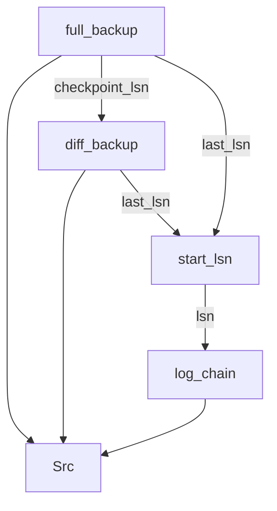

# 🔗 Cadena de Restauración a un Punto en el Tiempo

Script que determina la **cadena completa de backups necesaria** para restaurar una base de datos a un momento exacto, consultando el historial almacenado en `msdb`. Devuelve el FULL, el DIFFERENTIAL (si existe) y todos los LOG backups necesarios en el orden exacto en que deben aplicarse, validando la continuidad estricta de la cadena de LSN.

---

## ¿Para qué sirve?

Cuando necesitas hacer un **Point-in-Time Recovery** (PiTR), SQL Server requiere aplicar los backups en un orden específico sin gaps. Identificar manualmente qué backups usar — especialmente con múltiples ciclos de FULL y DIFF conviviendo en el historial — es propenso a errores. Este script lo determina automáticamente y de forma segura.

---

## Parámetros

```sql
DECLARE @database NVARCHAR(128) = '<TuBaseDeDatos>';
DECLARE @target_datetime DATETIME = '2025-11-07 14:03:12';
```

| Parámetro | Descripción |
|---|---|
| `@database` | Nombre de la base de datos a restaurar |
| `@target_datetime` | Momento exacto al que se quiere restaurar — se usará como `STOPAT` en el último `RESTORE LOG` |

---

## Script

```sql
DECLARE @database NVARCHAR(128) = '<TuBaseDeDatos>';
DECLARE @target_datetime DATETIME = '2025-11-07 14:03:12';

-- Validaciones
IF DB_ID(@database) IS NULL
BEGIN
    RAISERROR('Nombre de base de datos inválido', 16, 1);
    RETURN;
END;

IF @target_datetime > GETDATE()
BEGIN
    RAISERROR('Fecha objetivo en el futuro', 16, 1);
    RETURN;
END;

IF NOT EXISTS (
                SELECT 
                    NULL 
                FROM 
                    msdb.dbo.backupset 
                WHERE 
                    database_name = @database 
                    AND type = 'D' 
                    AND backup_finish_date <= @target_datetime
)
BEGIN
    RAISERROR('No existe FULL backup anterior a la fecha especificada', 16, 1);
    RETURN;
END;

WITH
-- FULL más reciente anterior a la fecha objetivo
full_backup AS (
    SELECT TOP 1
        'FULL' AS backup_type,
        1 AS apply_order,
        bs.backup_set_id,
        bs.media_set_id,
        bs.backup_start_date,
        bs.backup_finish_date,
        bs.first_lsn,
        bs.last_lsn,
        bs.checkpoint_lsn,
        bs.backup_size,
        bs.compressed_backup_size,
        bs.has_backup_checksums,
        CAST(NULL AS BIT) AS reached_target
    FROM 
        msdb.dbo.backupset bs            
    WHERE 
        bs.database_name = @database
        AND bs.type = 'D'
        AND bs.backup_finish_date <= @target_datetime
    ORDER BY 
        bs.backup_finish_date DESC
),
-- DIFF más reciente basado en ese FULL y anterior a la fecha objetivo si existe
diff_backup AS (
    SELECT TOP 1
        'DIFFERENTIAL' AS backup_type,
        2 AS apply_order,
        bs.backup_set_id,
        bs.media_set_id,
        bs.backup_start_date,
        bs.backup_finish_date,
        bs.first_lsn,
        bs.last_lsn,
        bs.checkpoint_lsn,
        bs.backup_size,
        bs.compressed_backup_size,
        bs.has_backup_checksums,
        CAST(NULL AS BIT) AS reached_target
    FROM 
        msdb.dbo.backupset bs
            CROSS JOIN 
        full_backup fb
    WHERE 
        bs.database_name = @database
        AND bs.type = 'I'
        AND bs.backup_finish_date <= @target_datetime
        AND bs.database_backup_lsn = fb.checkpoint_lsn
    ORDER BY 
        bs.backup_finish_date DESC
),
-- LSN de inicio de la cadena de logs: last_lsn del DIFF si existe, si no del FULL
start_lsn AS (
    SELECT COALESCE(
        (SELECT checkpoint_lsn FROM diff_backup), 
        (SELECT last_lsn FROM full_backup)
    ) AS lsn
),
-- Cadena de LOGs validando continuidad estricta de LSN mediante recursión
log_chain AS (
    SELECT
        'LOG' AS backup_type,
        3 AS apply_order,
        bs.backup_set_id,
        bs.media_set_id,
        bs.backup_start_date,
        bs.backup_finish_date,
        bs.first_lsn,
        bs.last_lsn,
        bs.checkpoint_lsn,
        bs.backup_size,
        bs.compressed_backup_size,
        bs.has_backup_checksums,
        -- Flag para detener la recursión tras incluir el LOG que contiene el STOPAT
        CASE WHEN bs.backup_finish_date >= @target_datetime THEN 1 ELSE 0 END AS reached_target
    FROM 
        msdb.dbo.backupset bs
            CROSS JOIN 
        start_lsn sl
    WHERE 
        bs.database_name = @database
        AND bs.type = 'L'
        AND bs.first_lsn <= sl.lsn
        AND bs.last_lsn > sl.lsn  

    UNION ALL

    -- Siguiente/s LOG cuyo first_lsn = last_lsn del anterior (continuidad estricta)
    -- La condición lc.reached_target = 0 detiene la recursión una vez considerado el LOG del STOPAT
    SELECT
        'LOG',
        3,
        bs.backup_set_id,
        bs.media_set_id,
        bs.backup_start_date,
        bs.backup_finish_date,
        bs.first_lsn,
        bs.last_lsn,
        bs.checkpoint_lsn,
        bs.backup_size,
        bs.compressed_backup_size,
        bs.has_backup_checksums,
        CASE WHEN bs.backup_finish_date >= @target_datetime THEN 1 ELSE 0 END
    FROM 
        msdb.dbo.backupset bs
            INNER JOIN 
        log_chain lc ON bs.first_lsn = lc.last_lsn
    WHERE 
        bs.database_name = @database
        AND bs.type = 'L'
        AND lc.reached_target = 0
),
Src AS (
    SELECT * FROM full_backup
      UNION ALL
    SELECT * FROM diff_backup
      UNION ALL
    SELECT * FROM log_chain
)    
SELECT 
    backup_type AS [Type],
    ROW_NUMBER() OVER (ORDER BY apply_order, backup_start_date) AS [Apply Order],
    backup_set_id AS [Backup Set ID],
    backup_start_date AS [Start Date],
    backup_finish_date AS [Finish Date],
    first_lsn AS [First LSN],
    last_lsn AS [Last LSN],
    checkpoint_lsn AS [Checkpoint LSN],
    CAST(backup_size / 1024.0 / 1024 AS DECIMAL(10,2)) AS [Backup Size (MB)],
    CAST(compressed_backup_size / 1024.0 / 1024 AS DECIMAL(10,2)) AS [Compressed Size (MB)],
    has_backup_checksums AS [Has Checksum],
    mf.physical_device_name AS [Files]
FROM 
    Src
        CROSS APPLY 
           (-- Todos los ficheros posibles de "stripe" separados por punto y coma
            SELECT 
                STRING_AGG(mf.physical_device_name, '; ') 
                    WITHIN GROUP (ORDER BY mf.family_sequence_number) AS physical_device_name
            FROM 
                msdb.dbo.backupmediafamily mf
            WHERE 
                mf.media_set_id = Src.media_set_id
                AND mf.device_type IN (2, 9)
                AND EXISTS (-- Valida que el media_set_id corresponde a nuestro backup_set
                    SELECT NULL FROM msdb.dbo.backupset bs2 
                    WHERE bs2.media_set_id = mf.media_set_id 
                    AND bs2.backup_set_id = Src.backup_set_id
                )
        ) mf
ORDER BY 
    apply_order, backup_start_date
OPTION (MAXRECURSION 1000);  -- Protección contra recursión infinita
```

---

## Cómo funciona internamente

### Estructura de CTEs



### `full_backup`

Localiza el FULL más reciente completado antes de `@target_datetime` consultando `msdb.dbo.backupset`. Es el punto de partida obligatorio de cualquier cadena de restauración — siempre hay exactamente uno en el resultado. Su `checkpoint_lsn` se usa en `diff_backup` para garantizar que el DIFF encontrado pertenece a este FULL concreto y no a otro ciclo de backup anterior.

### `diff_backup`

Localiza el DIFF más reciente completado antes del objetivo y vinculado al FULL concreto mediante `database_backup_lsn = fb.checkpoint_lsn`. Este filtro es crítico: un DIFF siempre almacena el `checkpoint_lsn` del FULL sobre el que se construyó, lo que garantiza que no se mezclan DIFFs de ciclos de backup distintos. Si no existe ningún DIFF válido esta CTE devuelve vacío y la cadena de LOGs arranca directamente desde el FULL.

### `start_lsn`

CTE auxiliar que materializa en un único valor el LSN de inicio de la cadena de logs — `last_lsn` del DIFF si existe, o `last_lsn` del FULL si no hay DIFF.

### `log_chain` (recursiva)

Es el núcleo del script. Funciona en dos partes:

- **Primer LOG:** localiza el primer LOG cuyo rango de LSN cubre el punto de inicio usando `first_lsn <= start_lsn AND last_lsn >= start_lsn`. El signo de igualdad se ha incluido para cubrir el caso en que no hay actividad entre el DIFF y el primer LOG, donde ambos valores pueden coincidir exactamente.

- **Parte recursiva:** cada iteración añade el siguiente LOG exigiendo `bs.first_lsn = lc.last_lsn` — continuidad estricta de LSN.

>**`reached_target`:** flag que se activa cuando `backup_finish_date >= @target_datetime`. El LOG que activa este flag es el que contiene el punto `STOPAT` — debe incluirse en el resultado porque SQL Server necesita ese fichero para poder detener la recuperación en el instante exacto solicitado. La condición `lc.reached_target = 0` en el JOIN de la parte recursiva detiene la recursión en el ciclo siguiente, evitando incluir LOGs posteriores al objetivo que no son necesarios.

### `Src`

Unión de los tres conjuntos mediante `UNION ALL`. Las columnas `reached_target` en `full_backup` y `diff_backup` existen únicamente para que las tres CTEs tengan el mismo número de columnas y tipos compatibles con `log_chain` donde la usamos para la gestión de la recursión.

### `SELECT` final

Aplica `ROW_NUMBER()` sobre `apply_order` y `backup_start_date` para generar el número de secuencia de aplicación, y resuelve los ficheros físicos del backup mediante un `CROSS APPLY` con `STRING_AGG` sobre `msdb.dbo.backupmediafamily`.

---

### Soporte para backups con stripe (múltiples ficheros)

Cuando un backup se distribuye en múltiples ficheros (*striped backup*), `backupmediafamily` contiene una fila por cada fichero del mismo `media_set_id`. Sin tratamiento especial, el JOIN estándar multiplicaría las filas del resultado devolviendo una línea por fichero en lugar de una por backup.

La solución es agregar los ficheros en un único campo separado por `;` usando `STRING_AGG` ordenado por `family_sequence_number`, que garantiza que los ficheros aparecen en el orden de stripe correcto — el mismo orden que debe usarse en las instrucciones `RESTORE`.

```sql
CROSS APPLY 
        (   SELECT 
                STRING_AGG(mf.physical_device_name, '; ') 
                    WITHIN GROUP (ORDER BY mf.family_sequence_number) AS physical_device_name
            FROM 
                msdb.dbo.backupmediafamily mf
            WHERE 
                mf.media_set_id = Src.media_set_id
                AND mf.device_type IN (2, 9)
                AND EXISTS (-- Valida que el media_set_id corresponde a nuestro backup_set
                    SELECT NULL FROM msdb.dbo.backupset bs2 
                    WHERE bs2.media_set_id = mf.media_set_id 
                    AND bs2.backup_set_id = Src.backup_set_id
                )
        ) mf
```

> ⚠️ `STRING_AGG` requiere **SQL Server 2017 o superior**. En versiones anteriores debe sustituirse por `FOR XML PATH`:
> ```sql
> CROSS APPLY 
>    (  SELECT STUFF(
>         (SELECT '; ' + mf2.physical_device_name
>          FROM msdb.dbo.backupmediafamily mf2
>          WHERE mf2.media_set_id = Src.media_set_id
>            AND mf2.device_type  IN (2, 9)
>            AND EXISTS (-- Valida que el media_set_id corresponde a nuestro backup_set
>                    SELECT NULL FROM msdb.dbo.backupset bs2 
>                    WHERE bs2.media_set_id = mf2.media_set_id 
>                    AND bs2.backup_set_id = Src.backup_set_id
>                )
>          ORDER BY mf2.family_sequence_number
>          FOR XML PATH(''), TYPE).value('.', 'NVARCHAR(MAX)')
>     , 1, 2, '') AS physical_device_name
>   ) mf
> ```

---

## Uso del resultado — instrucciones RESTORE

Con el resultado del script, las instrucciones de restauración podrían quedar así:

```sql
-- 1. Restaurar el FULL (siempre con NORECOVERY)
RESTORE DATABASE [<TuBaseDeDatos>]
    FROM DISK = '<backup_file del FULL>'
    WITH 
        NORECOVERY, 
        STATS = 10;

-- 2. Restaurar el DIFF si existe (con NORECOVERY)
RESTORE DATABASE [<TuBaseDeDatos>]
    FROM DISK = '<backup_file del DIFF>'
    WITH 
        NORECOVERY, 
        STATS = 10;

-- 3. Aplicar cada LOG en orden con NORECOVERY, excepto el último
RESTORE LOG [<TuBaseDeDatos>]
    FROM DISK = '<backup_file LOG 1>'
    WITH 
        NORECOVERY, 
        STATS = 10;

-- ...repetir para cada LOG intermedio...

-- 4. Último LOG: usar STOPAT con la fecha objetivo y RECOVERY para dejar la BD en línea
RESTORE LOG [<TuBaseDeDatos>]
    FROM DISK = '<backup_file último LOG>'
    WITH 
        RECOVERY, 
        STOPAT = '2026-02-26 14:08:01.000';
```

> ⚠️ Todos los pasos intermedios deben usar `NORECOVERY`. Solo el último `RESTORE LOG` usa `RECOVERY` con `STOPAT`. Si se aplica `RECOVERY` antes del último paso la base de datos queda en línea en ese punto y no se pueden aplicar más backups.

> ⚠️ La información de ficheros lógicos de cada backup está en msdb.dbo.backupfile. Podemos aprovecharnos del backup_set_id que ya tenemos en full_backup para obtener los nombres lógicos y sugerir rutas alternativas que no colisionen con los ficheros existentes a través del siguiente script:
```sql
-- Sustituir @full_backup_set_id por el Id del FULL devuelto
DECLARE @full_backup_set_id INT = <backup_set_id>;
DECLARE @restore_suffix NVARCHAR(20) = '_restored';

SELECT 
    bfl.logical_name AS [Logical Name],
    bfl.physical_name AS [Original Path],
    CASE bfl.file_type
        WHEN 'D' THEN 'Data'
        WHEN 'L' THEN 'Log'
        WHEN 'F' THEN 'Filestream'
        WHEN 'S' THEN 'Memory Optimized'
        ELSE 'Unknown'
    END AS [File Type],
    -- Generar path de restauración con sufijo antes de la extensión
    CASE 
        WHEN bfl.physical_name LIKE '%\%.%' THEN
            -- Insertar sufijo antes de la última extensión
            LEFT(bfl.physical_name, LEN(bfl.physical_name) - CHARINDEX('.', REVERSE(bfl.physical_name))) 
            + @restore_suffix 
            + RIGHT(bfl.physical_name, CHARINDEX('.', REVERSE(bfl.physical_name)))
        ELSE
            -- Sin extensión, añadir sufijo al final
            bfl.physical_name + @restore_suffix
    END AS [Suggested Restore Path],

    -- Columnas adicionales útiles para el RESTORE DATABASE
    bfl.file_number AS [File ID],
    bfl.filegroup_name AS [Filegroup]
FROM 
    msdb.dbo.backupfile bfl
WHERE 
    bfl.backup_set_id = @full_backup_set_id
    AND bfl.state = 0  -- Solo archivos online (0 = online, 1 = restoring)
ORDER BY 
    bfl.file_type,      -- Log al final (L > D en orden descendente, o usar CASE)
    bfl.logical_name;
```
---

## Interpretación de campos del resultado

| Campo | Descripción |
|---|---|
| `Type` | Tipo de backup: `FULL`, `DIFFERENTIAL` o `LOG` |
| `Apply Order` | Número de secuencia de aplicación — usar este orden en los `RESTORE` |
| `Id` | `backup_set_id` en `msdb` — referencia interna del backup |
| `Start Date` | Inicio del proceso de backup |
| `Finish Date` | Fin del proceso de backup |
| `First LSN` | Primer Log Sequence Number (LSN) cubierto por este backup |
| `Last LSN` | Último LSN cubierto por este backup |
| `Checkpoint LSN` | LSN del último checkpoint activo en el momento del backup |
| `Backup Size (Mb)` | Tamaño sin comprimir del backup |
| `Compressed Size (Mb)` | Tamaño comprimido real en disco |
| `Has Checksum` | Indica si el backup se realizó con `CHECKSUM` |
| `Files` | Ruta física del fichero de backup a usar en el `RESTORE` |

---

## Requisitos

- Recovery Model `FULL` o `BULK_LOGGED` en el momento en que se generaron los backups de log
- Historial de backups disponible en `msdb` — si se ha purgado el script no devolverá resultados (`msdb.dbo.sp_delete_backuphistory`)
- Permisos: `VIEW DATABASE STATE` o rol `db_backupoperator` en `msdb`

---

### Valores de `device_type` en `backupmediafamily`

| Valor | Descripción |
|---|---|
| `2` | Disco — fichero `.bak` / `.trn` local o ruta UNC |
| `5` | Cinta física |
| `7` | Virtual device — soluciones de backup de terceros (Veeam, NetBackup, etc.) |
| `9` | URL — Azure Blob Storage |
| `105` | Permanent backup device (`sp_addumpdevice`) |

El filtro `device_type IN (2, 9)` se centra en los dispositivos más habituales. Ajustar si se requiere.

---

## Alternativas nativas y herramientas de la comunidad

SQL Server no dispone de ningún procedimiento almacenado nativo para retornar la cadena de restauración a un punto en el tiempo consultando el historial de `msdb`. Las únicas herramientas nativas relacionadas con el análisis de backups operan sobre ficheros físicos, no sobre el historial:

- **`RESTORE HEADERONLY`** — devuelve los metadatos de un fichero de backup concreto: tipo, fechas, LSNs, compresión, cifrado, etc. Requiere acceso al fichero físico y no tiene capacidad de construir cadenas ni de consultar `msdb`.
- **`RESTORE FILELISTONLY`** — devuelve los ficheros lógicos de datos y log contenidos en un backup. Útil para preparar un `RESTORE` con `MOVE`, pero sin ninguna lógica de encadenamiento.
- **`RESTORE VERIFYONLY`** — comprueba que un fichero de backup es legible y estructuralmente válido. No valida que los datos sean recuperables ni que la cadena sea completa.

Ninguna de estas opciones consulta `msdb`, ninguna razona sobre LSNs de forma encadenada y ninguna tiene en cuenta el concepto de punto en el tiempo. La construcción de la cadena de restauración ha sido históricamente una tarea manual del DBA.

En el ecosistema de la comunidad, **dbatools** — la librería de PowerShell de referencia para administración de SQL Server — sí resuelve este problema a través de `Get-DbaBackupInformation`:
```powershell
Get-DbaBackupInformation -SqlInstance SRV-2K22-DB01 `
                         -DatabaseName AdventureWorksLT2022 `
                         -Path "H:\DATA\" | 
                        Select-DbaBackupInformation -RestoreTime "2025-11-07 14:03:05" |
                        Sort-Object Type, Start -Unique
```

Esta función escanea los archivos de copia de seguridad y lee sus encabezados para crear objetos estructurados de historial de backups que se utilizan en operaciones de restauración. Puede además encadenarse directamente con `Restore-DbaDatabase` para ejecutar la restauración completa en un único pipeline de PowerShell, generando y ejecutando las instrucciones `RESTORE` en el orden correcto y con el `STOPAT` adecuado.

Nuestro script opera en T-SQL puro, sin dependencias externas y directamente desde cualquier cliente SQL — SSMS, Azure Data Studio o cualquier aplicación con acceso a la instancia. Esto lo hace especialmente útil en entornos donde PowerShell está restringido, donde no es posible instalar módulos externos, o simplemente cuando se necesita una validación rápida de la cadena disponible antes de iniciar un proceso de restauración.
